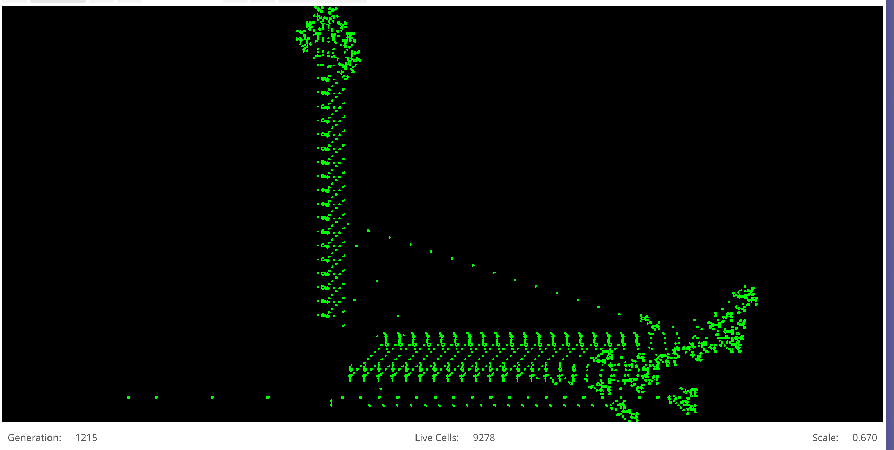
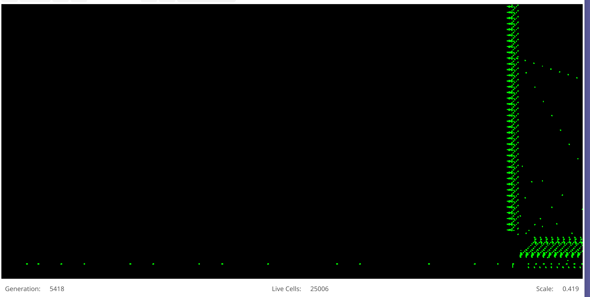

# Example Patterns

In the [Tour](Tour.md) we explored the simple examples of a _glider_ and
_blinker_, but now we'll explore some more interesting patterns.

The first is the the [Gosper Glider Gun](https://conwaylife.com/wiki/Gosper_glider_gun).
A question early on was whether all patterns eventually stagnated into simple oscilators,
static elements or would die out entirely.  That's what the inventor of the game, 
[John Conway](https://en.wikipedia.org/wiki/John_Horton_Conway) guessed, but offered a 
prize to anyone who could disprove his conjecture.  Soon (all the way back in 1970) 
a team at MIT lead by [Bill Gosper](https://en.wikipedia.org/wiki/Bill_Gosper) managed
to do that with the _glider gun_ pattern.  

Go to **Examples**->**Growing**->**Gosper Glider Gun**, and you'll load the pattern. It
doesn't look all that interesting, and only has 36 living cells initially, but if you click
**Run** you'll get a surprise.  At generation 15 (and every 30 thereafter), it spits out 
a _Glider_.  With nothing to stop them, they march off to infinity, and the pattern grows
indefinitely.

There are other patterns that grow indifintely. Like the **Block Laying Switch Engine** (also
under **Examples**->**Growing**).  For that one you may want to crank up the speed to about
60 generations/second (and make sure **Auto-Zoom** is enabled.)  This is strictly a type of 
Puffer, but we'll get to that in a moment.

There are other types too.  

## [Spaceships](https://conwaylife.com/wiki/Spaceship)

First there are the Spaceships.  Like _gliders_, they move across the grid.
Some (like the Lobster **Examples**->**Ships&Such**->**lobster.rle**) move
diagonally, while others like the **canadagrey.rle** ship move vertically
or horizontally. Relatively recently there has also been the discovery of
ships that move up 2 and over 1 (like the knight in chess), and so
they're called a [Knight Ship](https://conwaylife.com/wiki/Knightship).
The first was discovered in 2010 by Dave Greene and called **Sir Robin**.

## [Puffers](https://conwaylife.com/wiki/Puffer)

Puffers are spaceships that leave debris behind them. Take for example
the **Frothing Puffer**, which moves vertically, but leaves a trail of
blocks and blinkers in it's wake.  A simpler example is **Blinker
Puffer 1**, which uses a couple of
 [Light Weight Space Ships](https://conwaylife.com/wiki/Lightweight_spaceship)
(LWSS) and a structure in between them to leave beind _blinkers_.

## [Rakes](https://conwaylife.com/wiki/Rake)

Rakes a puffers that spit out other spaceships, like the **Backrake 1**
which moves vertically, but spits out gliders.  They can become part of 
larger structures like the **Flying Wing** which has 4 _backrakes_ and
a few other structures to create what is a growing spaceship.

## Computational

One of the most fascinating areas is computational patterns. The 
_Game of Life_ is actually
[Turing Complete](https://en.wikipedia.org/wiki/Turing_completeness)!
Which means that it can do all the same things as a traditional
computer, though not as quickly.

Take for example, calculating [prime numbers](https://en.wikipedia.org/wiki/Prime_number)
(Numbers greater than 1 that are divisible only by themselves and 1).
If you load up **Examples**->**Computational**->**Primer** you'll see
the first pattern that was known to calculate prime numbers. It uses
_puffers_, _rakes_, _spaceships_, and _oscilators_ (and a **boatload**
of _gliders_) to find prime numbers. It looks like (after about 1200 
generations):

At the bottom left it spits out a series of _lightweight spaceships_
representing prime numbers. (2, 3, 5, 7 ....) and if you let it run
for 5000 generations, the _oscilator_ at the bottum  will look continue
to let through only _spaceships_ that represent prime numbers 
(... 11, 13, 17, 19, 23, 29, 31, 37, 39, ...):

There are other computational patterns, like one that calculates
the number π (Pi) (**Examples**->**Computational**->**Compute Pi**),
several newer (and faster) varients of prime number generators,
and severals iterations of primative
[Turing Machines](https://en.wikipedia.org/wiki/Turing_machine).
You may need to zoom in a ways before you see much interesting
happening on these patterns, and they won't run very quickly.

The largest of these (**Fully Universal Turing Machine**), is 
absolutely _huge_), starting with approximately 650,000 cells on a 
grid stretching nearly 100,000 by 100,000 cells, and after 
250,000 generations (takes a while), had more than 2.5 million
cells and had grown considerably.

This patterns runs very slowly, taking about 1 second per
generation on my MacBook air (at the beginning)  If you're
trying to run this on your mac with the pre-packaged app,
it may quit after a few minutes because the OS thinks it
is using too much processing power and might be malicious.
This is a [known issue](https://github.com/pneumaticdeath/GooeyLife/issues/7).

## Fun patterns

There are also pattens that are just fun or interesting to
look at.  One was a tribute to John Conway when he passed
away in 2020 published in the (very nerdy) webcomic 
[XKCD](https://xkcd.com/2293/).  You can load it yourself at
**Examples**->**Fun**->**Conway Tribute**, and it really 
does what the webcomic depicts.

There are also a couple of patterns (**Whirlpool** and
**Swirly**) that I found that I just think are pretty and run
for over a thousand generations before stagnating.

Now why don't you try to [find your own interesting patterns](Creating.md)!
