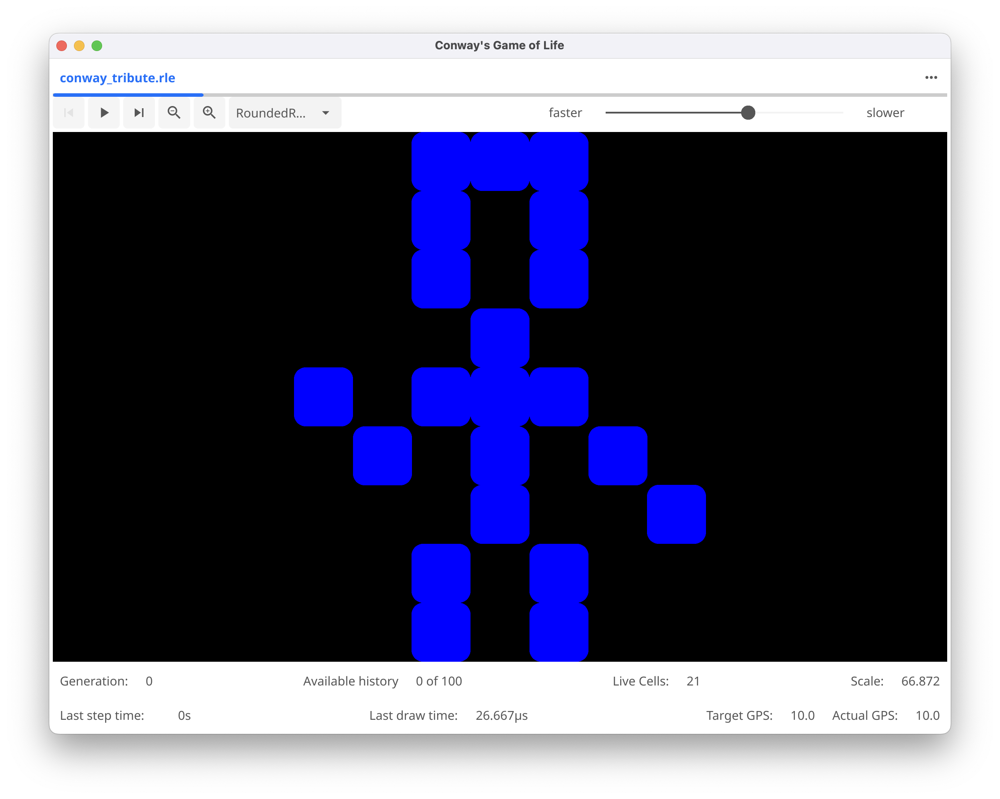
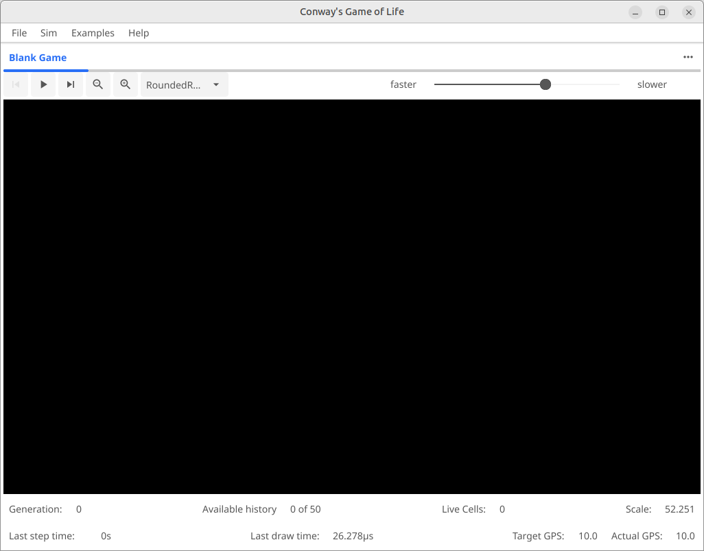
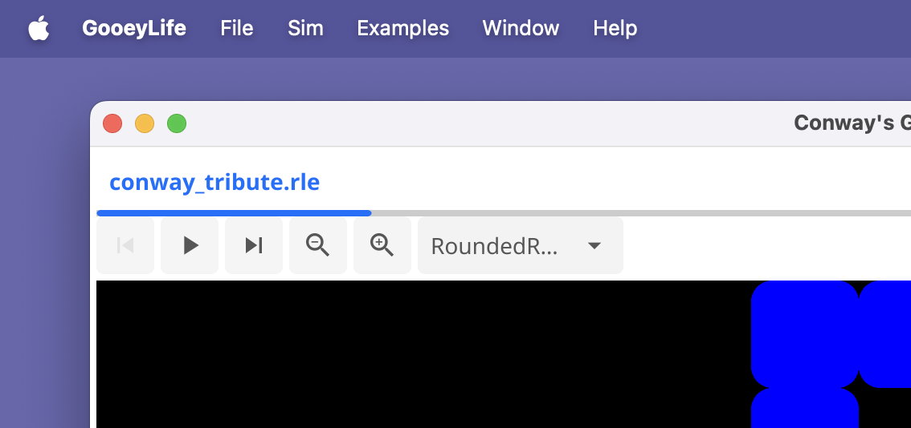
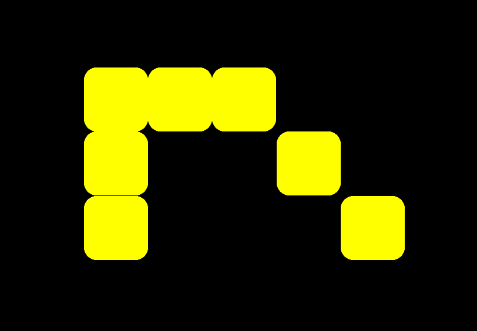
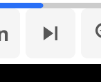
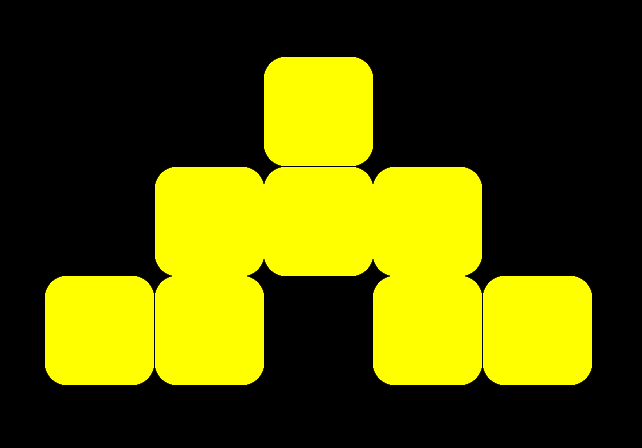
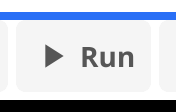
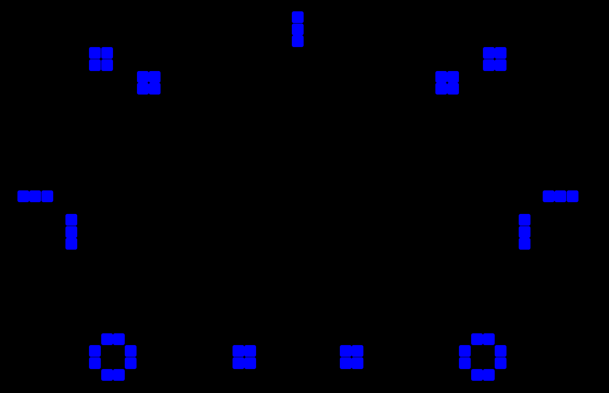
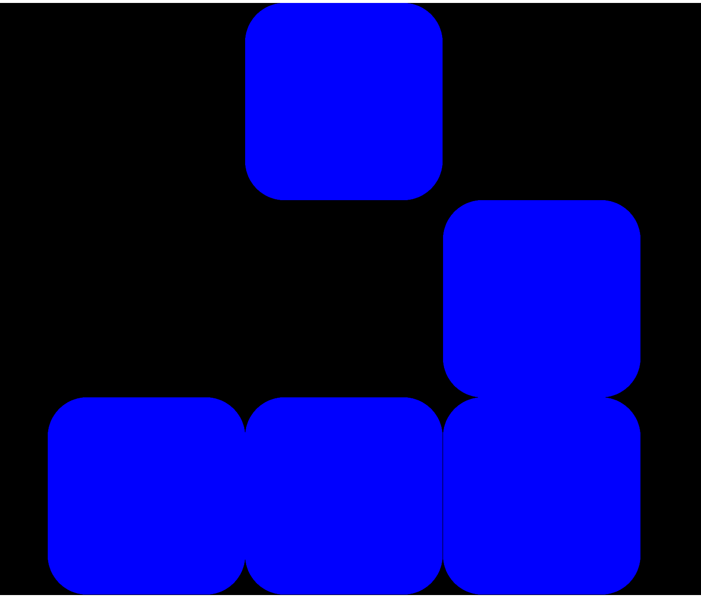
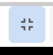

# Tour of GooeyLife

The screen looks like (on a mac)

or (on linux)

Things to notice.  The menus at the top

and the control bar near the top of the window

The important menus are **File** and **Examples**.

The control bar has a number of buttons and widgets
* On the left you can run the simulation or move the simulation forward (or backward) a single generation.
* Next are a group of controls to allow you to zoom in on a large population of cells, but we'll leave those alone for now.
* A drop down list that allows you to select the shape of cells (purely cosmetic)
* A checkbox to enable *Edit Mode*
* And a slider to allow you to control the speed of the simulation while running.

Nothing will do much interesting at this point, because there are no living cells.  Let's change that.
Click the checkbox for *Edit Mode* and click somewhere on the screen to make a living cell.  You can 
play with this, but try making this pattern:

and then press the single step button .  and it will evolve into

Now feel free to press the Run button  and watch it evolve.  If you haven't
disabled Auto-Zoom, it should automatically zoom out to keep the whole pattern in the window.

 After about 190 generations you can stop it by pressing the Run button again (though now it will be labeled
**Pause**).  It'll reach a stable (though not static) pattern:

Most patterns will eventually reach a point where they go into a simple repeating pattern (like the
*Blinkers* of 3 cells that flip back and forth), a completely static pattern like the blocks of 4,
or may even die out entirely. But that's not always the case...

Try loading the **Glider** example going to **Example**->**Simple**->**Glider** in the menus. It'll look like 

Just like the icon of the program if you switch to "Circle" shapes. It's a  deceptively simple pattern,
but it turns out to be one of the most important patterns around.  Click **Run** again, and you'll
notice it starts to walk or _glide_ off toward the lower right side of the screen. You can use the
**Edit Mode** to add a blinker of block to prove that it's moving.  You can also turn off **Auto-Zoom**
and watch it walk right off the screen.

While it's no longer visible, it's still there. The grid on which the cells live is effectively infinite.
(Actually 2^64 by 2^64 is the limit, but that's almost impossible to reach.)

You can stop the simulation and *click and drag* the glider back onto the screen, or turn auto-zoom back
on, or click the "zoom to fit" . to bring it back onto the screen.

You can play with the cell shapes if you like, but the only other control is the _Speed_ control.  Bring
up the **Example**->**Simple**->**Blinker** example, turn auto-zoom back on (if it's off) and then click
**Run**.  Slide the speed control to the right and it will get slower, or to the left to make it faster.
The range of possible updates is 1 generation/second on the right, to a little over 300 generations/second
on the left.

Note: While it's possible to calculate 300 generations/second on simple patterns, the display refresh is
limited to 60hz by default because of limitations with the graphics framework.  Also, while you can ask
the system to calculate >300 generations/second, most complex patterns will max out available processor
power at much slower speeds.  Check out the **Target GPS** and **Actual GPS** display in the lower right
if you want statistics.

Now let's explore more of the [Examples](Examples.md)
