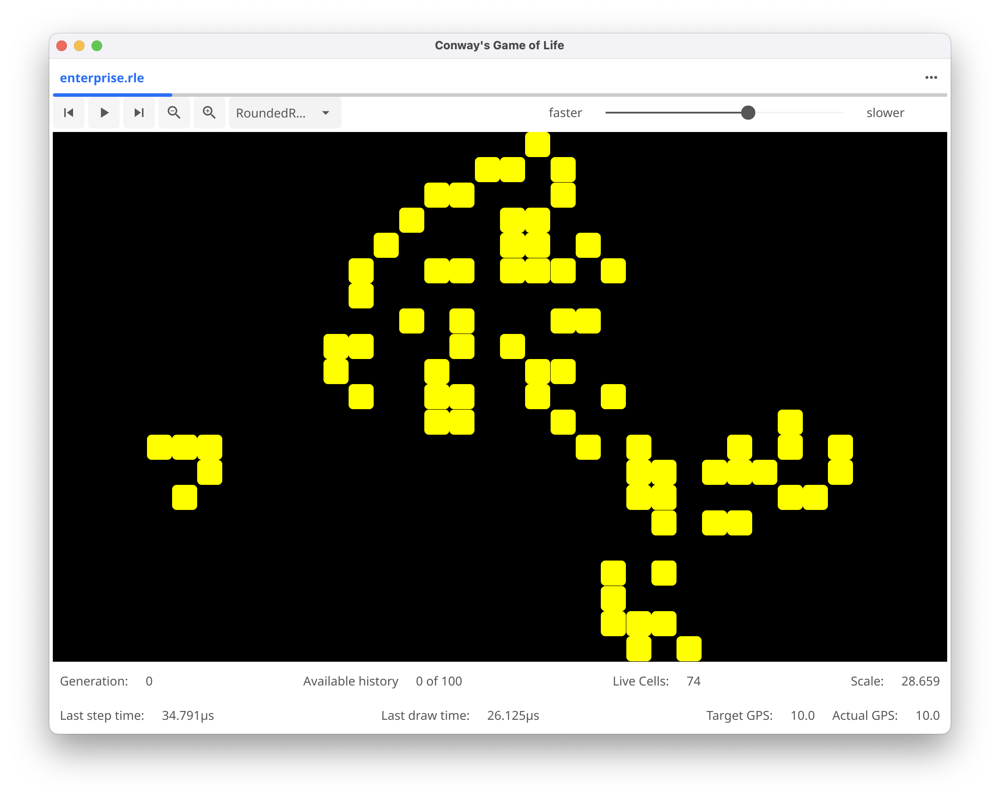

# GooeyLife

Copyright 2024, 2025 Mitch Patenaude

This is a golang implementation of a GUI frontend to the
[golife](https://github.com/pneumaticdeath/golife) Game of Life engine
implemented using the [Fyne](https://fyne.io/) windowing toolkit.

Both this and the golife package are still in early alpha stage of 
devepment.  I'm aiming to make this cross platform with macOS, Window and
Linux, but currently lack a windows build machine.

Check out the [releases](https://github.com/pneumaticdeath/guiLife/releases) page for a selection of builds.

Here are some screenshots:

The About Box

Editing Patterns

Running Patterns

Handles BIG patterns (this one is about 260K cells, I've loaded patterns of over 2.5M cells)

Zoom in on complex patterns

Edit your settings

