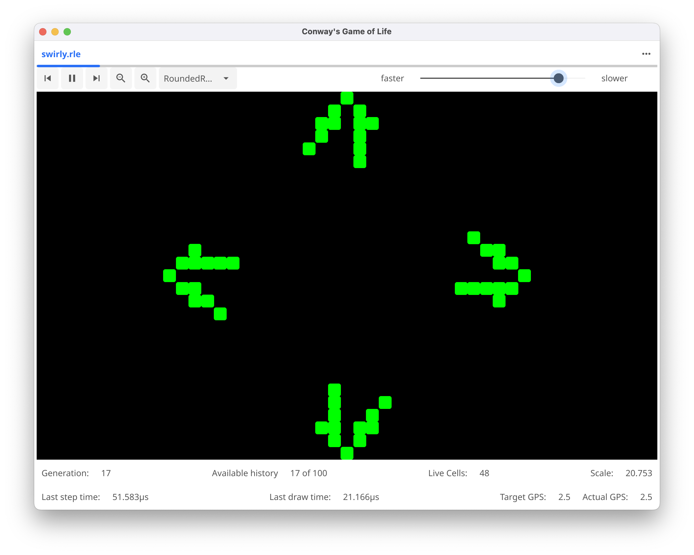
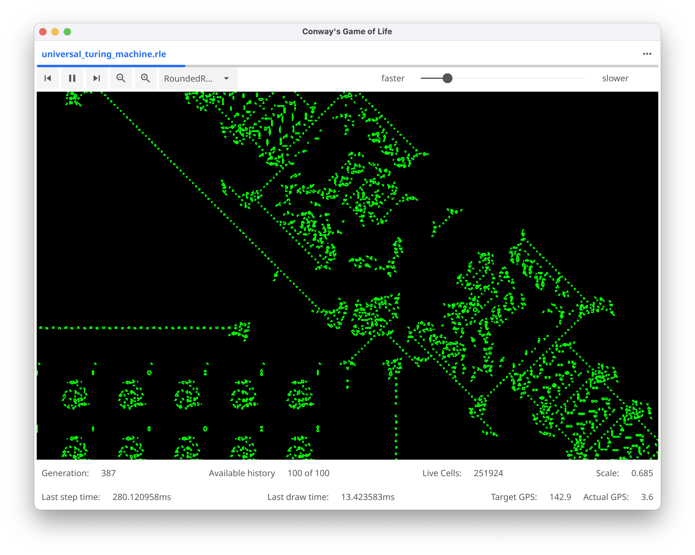

# GooeyLife

Copyright 2024, 2025 Mitch Patenaude

This is an implementation of a GUI frontend to the
[golife](https://github.com/pneumaticdeath/golife) Game of Life engine
implemented using the [Fyne](https://fyne.io/) windowing toolkit.

Check out the [releases](https://github.com/pneumaticdeath/guiLife/releases) page
for the latest builds.

Here are some screenshots:

Basic interface:

Editing Patterns:

Running Patterns:

Handles BIG patterns:

(this one is about 260K cells, I've loaded patterns of over 2.5M cells)

Zoom in on complex patterns:

Edit your settings:

